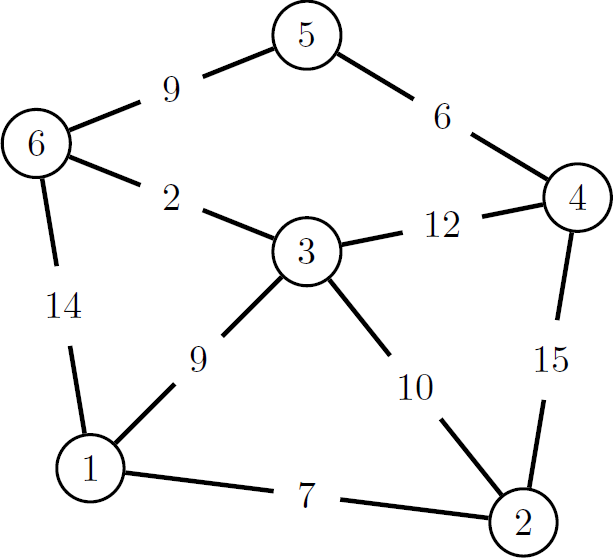
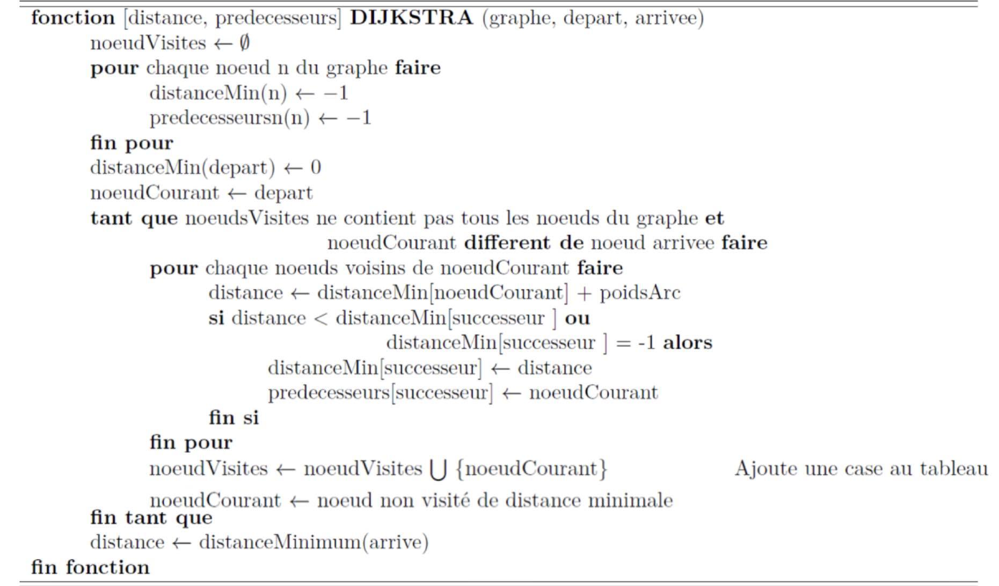
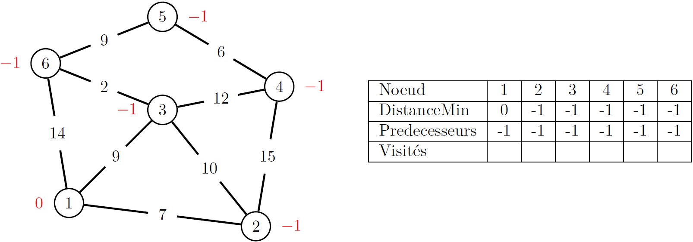
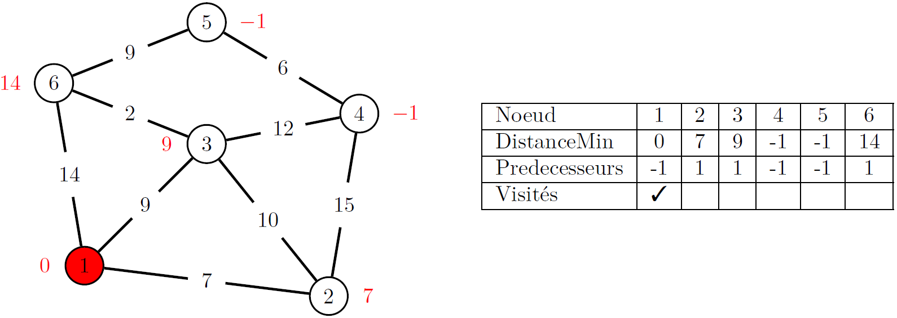
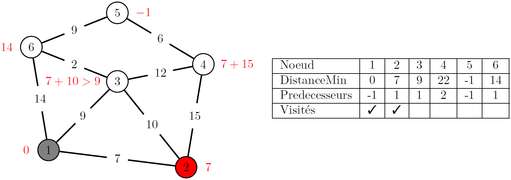
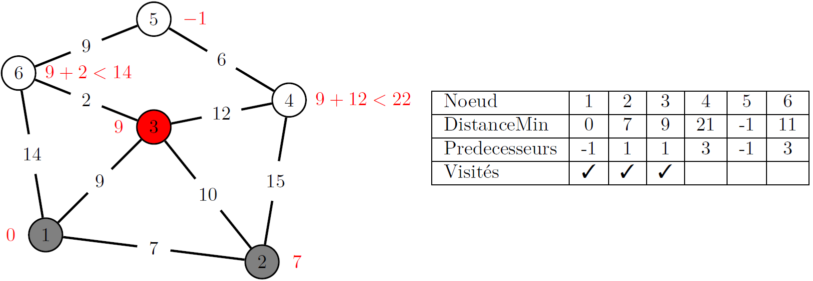
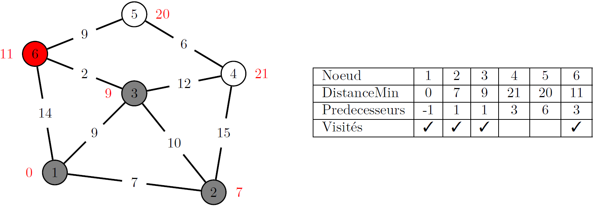
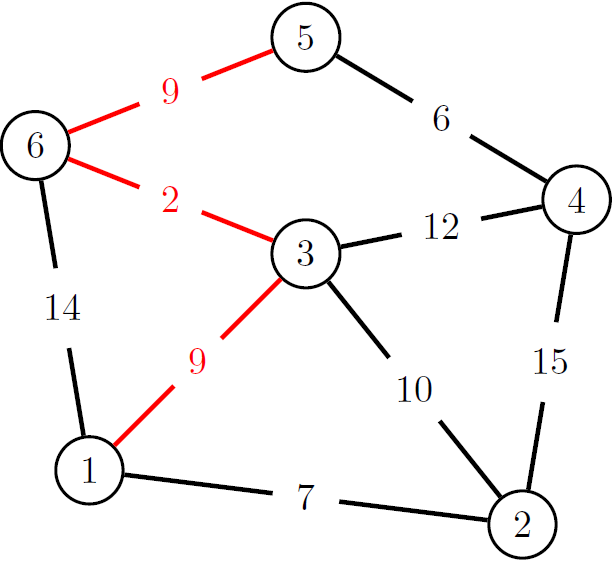
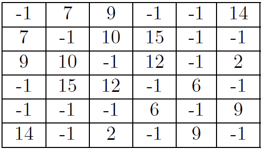
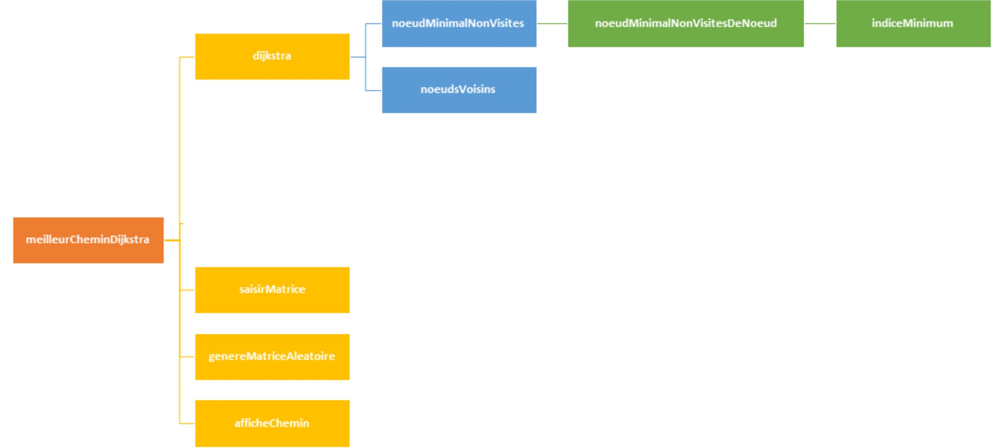

<p align="center">
  
</p>

# TP3: Fonctions et algorithmes sur graphes
- [Directives particulières](#directives)
- [Énoncé de travail](#enonce)
- [Concepts](#concepts)
  - [L’algorithme de Dijkstra](#djikstra)  
  - [Représentation de graphe sous forme de matrice adjacente](#representation)
- [Modules à implémenter](#module)
  - [Module algo](#algo) 
  - [Module interface](#interface)
  - [Module principale](#principale)
- [Barème](#bareme)
- [Annexe: Guide et normes de codage](#annexe)

:alarm_clock: [Date de remise le dimanche 30 octobre à 23h59](https://www.youtube.com/watch?v=DLzxrzFCyOs)

## Directives particulières <a name="directives"></a>
* Respecter [guide de codage](https://github.com/INF1007-Gabarits/Guide-codage-python) et les normes pep8;
* Noms de variables et fonctions adéquats (concis, compréhensibles);  
* Pas de librairies externes autres que celles déjà importées;  
* Dans chaque programme, vous pouvez ajouter d’autres fonctions à celles décrites dans l’énoncé pour améliorer la lisibilité.

## 1. Énoncé de travail <a name="enonce"></a>
<p align='justify'> Dans le cadre de ce laboratoire, vous devrez réaliser un programme qui permet de trouver le plus court chemin dans un graphe. Il existe plusieurs algorithmes qui permettent de déterminer le plus court chemin dans un graphe. Dans le cadre de ce laboratoire, nous avons choisi d’implémenter l’algorithme de Dijkstra. </p>

Le travail demandé consiste à :
* Implémenter l’Algorithme de Dijkstra (un pseudo-code est fourni dans la section 2.1).
* Programmer les fonctionnalités nécessaires pour valider les données.
* Programmer un menu principal qui permet à l’usager de choisir parmi les fonctionnalités suivantes :
  1. <p align='justify'>Trouver le plus court chemin dans un graphe saisi par l’utilisateur. L’utilisateur doit saisir la matrice d’adjacente (le nombre des nœuds et les poids des arcs) ainsi que le nœud de départ et le nœud d’arrivée.</p>
  2.  <p align='justify'>Trouver le plus court chemin dans un graphe généré aléatoirement : l’utilisateur saisit le nombre le nœud, ensuite la matrice et généré avec des poids d’arcs aléatoires. La matrice d’adjacence est affichée et l’utilisateur est invité à saisir le nœud de départ et le nœud d’arrivée.</p>

Dans ce qui suit, nous expliquons les différents concepts.

## 2. Concepts <a name="concepts"></a>
<p align='justify'> Un graphe est un ensemble de points appelés *nœuds* et de segments appelés *arcs*. Ces arcs peuvent être pondérés en termes de *poids* pour représenter le coût ou la distance entre les nœuds. Un graphe peut servir à représenter un réseau informatique, un réseau de transport, une carte topographique (voir figure 1).</p>


<p align="center"> 
   
    <br>
    <em><b>Fig. 1 : Exemple de graphe pondéré.</b></em>
</p>

<p align='justify'> On définit un chemin dans un graphe pondéré comme une suite de nœuds reliés deux à deux par des arcs et le poids d’un chemin comme la somme des poids des arcs de cette suite (voir figure 2).</p>

<p align="center">
   
    <br>
    <em><b>Fig. 2 : Chemin 1,3,6,5 de poids total égal à 20.</b></em>
</p>

<p align='justify'> L’algorithme de Dijkstra permet de résoudre le problème suivant : étant donné un graphe pondéré, un nœud de départ et un nœud d’arrivée, trouver le chemin le plus court allant du nœud départ au nœud d’arrivée.</p>

### 2.1. L’algorithme de Dijkstra <a name="djikstra"></a>
<p align='justify'> On donne ci-dessous l’algorithme de Dijkstra en *pseudo-code* permettant de déterminer la distance mini- male d’un nœud de départ à un nœud d’arrivée.</p>

<p align="center">
  
</p>

<p align='justify'> Les figures de 3 à 8 montrent l’application de l’algorithme de Dijkstra sur le graphe de la figure 1 pour trouver le plus court chemin pour aller du nœud de départ <b>1</b> au nœud d’arrivée <b>5</b> et montrent le contenu des différents tableaux utilisés dans l’algorithme à chaque itération. Les nœuds en <b>gris</b> sont les nœuds déjà visités et le nœud en <b>rouge</b> est le nœud en cours de visite qui sera ajoutée aux nœuds visités. </p>
  
<p align='justify'>Le tableau ”<b>distanceMin</b>” initialisé à des −1 qui seront remplacés par des distances au fur et aux mesures par que l’algorithme avance. À la fin de l’exécution de l’algorithme, ce tableau contient les distances minimales qui séparent chaque nœud au nœud de départ - entre autres le nœud d’arrivée. </p>
  
<p align='justify'>De même le tableau des prédécesseurs est initialisé à des −1 qui seront remplacés par le prédécesseur de chaque nœud dans le plus court chemin qui le sépare du nœud de départ.</p>

<p align="center">
  
    <br>
    <em><b>Fig. 3 : Initialisation.</b></em>
</p>

<p align='justify'>  Le premier nœud à visiter est le nœud de départ (1) (voir figure 4), on calcule les distances des voisins et on met à jour les tableaux. Le nœud (1) est par la suite ajouté à l’ensemble des nœuds visités.</p>

<p align="center">
  
    <br>
    <em><b>Fig. 4 : Visite du nœud 1.</b></em>
</p>

<p align='justify'>  Le nœud non visité qui a la distance la plus petite dans le tableau *Distancement* est le nœud (2). Par la suite, il devient le nœud suivant à visiter (figure 5). Et ainsi de suite (voir les figures 6 et 7).</p>

<p align="center">
  
    <br>
    <em><b>Fig. 5 : Visite du nœud 2.</b></em>
</p>

<p align="center">
  
    <br>
    <em><b>Fig. 6 : Visite du nœud 3</b></em>
</p>

<p align="center">
  
    <br>
    <em><b>Fig. 7 : Visite du nœud 6.</b></em>
</p>

<p align='justify'> Le nœud suivant à visiter après le nœud (6) est le nœud (5) qui est le nœud d’arrivée. À ce stade, l’algorithme s’arrête. Pour trouver le plus court chemin entre le nœud de départ et le nœud d’arrivée, on utilise le tableau des prédécesseurs. On prend le prédécesseur du nœud d’arrivée, dans notre exemple le prédécesseur du nœud d’arrivée (5) est le nœud (6), le prédécesseur du nœud (6) est le nœud (3), ainsi de suite jusqu’à atteindre le nœud de départ (1). Le plus court chemin entre le nœud (1) et (5) est (1) => (3) => (6) => (5) ayant comme distance la somme des poids des arcs qui vaut 20.</p>

<p align="center">
  
    <br>
    <em><b>Fig. 8 : Le plus court chemin pour aller de 1 à 5 est 1,3,6,5 le poids total est 20.</b></em>
</p>


### 2.2.Représentation de graphe sous forme de matrice adjacente <a name="representation"></a> 
<p align='justify'>On peut considérer que le graphe comporte N nœuds numérotés de 1 à N, et représenter ses arcs par un tableau de nombres de deux dimensions N x N, de sorte que si l’élément [i, j] du tableau vaut −1, il n’existe pas d’arc allant du nœud i au nœud j, et s’il est positif, il existe un tel arc et sa longueur est donnée par ce nombre.</p>

<p align='justify'> Ce tableau de deux dimensions forme la matrice d’adjacente qui représente le graphe ; c’est une matrice symétrique. La figure 9 représente la transformation du graphe de l’exemple précédent en une matrice d’adjacente.</p>


<p align="center">
  
    <br>
    <em><b>Fig. 9 : Transformation du graphe de la figure 1 en une matrice d’adjacente.</b></em>
</p>

## 3. Modules à implémenter <a name="module"></a>

La figure 12 représente l'arbre des appels de fonctions à implémenter.

<p align="center">
  
    <br>
    <em><b>Fig. 12 :Arbre des appels de fonctions.</b></em>
</p>

### 3.1. Module algo:<a name="algo"></a> 

<dl>
  <dt>3.1.1. indiceMinimum(vec):</dt>
  <dd><p align='justify'>Trouve l’indice et la valeur minimum dans un vecteur. La fonction ne doit pas considérer les cases avec une valeur de -1. Si toutes les cases sont à -1, 	on retourne le minimum -1 et l’indice -1.
  </p></dd>
  <dd><b>Paramètres:</b></dd>
		<ol><ul>
			<li><b> vec[1xn]</b>: Vecteur des valeurs à parcourir.</li>
  	</ul></ol>
	<dd><b>Renvoie:</b></dd>
		<ol><ul>
			<li><b>indice[1x1]</b>: l’indice de la case minimum.</li>
			<li><b>minim[1x1]</b>: la valeur minimum du vecteur.</li>
  	</ul></ol>
		<dd><p align='justify'><code> <b>Note:</b> Valide que vec est une liste de valeurs numériques plus grandes ou égales à -1s.</code></p></dd>

</dl>	

<dd><b>Exemple:</b></dd>

```python
vec     = [-1, 4, 6, -1, -1, 3, 5]
indice, minimum = indiceMinimum(vec)
txt = "la valeur minimale du vecteur est {} à la position {}"
print(txt.format(minimum, indice))
```

    la valeur minimale du vecteur et 3 à la position 5
-------------------------------------------------------------------------------------------------------------------------------------------------------


<dl>
  <dt> 3.1.2. noeudMinimalNonVisitesDeNoeud(matrice, nœud, noeudsVisites):</dt>
  <dd><p align='justify'>Cherche le nœud non visité ayant le poids minimum autour d’un nœud spécifique. Recherche seulement les liens au nœud initial. Retourne le nœud minimum. 	et son poids.
  </p></dd>
  <dd><b>Paramètres:</b></dd>
		<ol><ul>
			<li><b>Matrice[mxn]</b>: Matrice d’adjacence.</li>
			<li><b>noeud[1x1]</b>: Le nœud autour duquel on veut chercher le nœud non visité minimum.</li>
			<li><b>noeudsVisites[1xn]</b>: La liste des nœuds visités.</li>
  	</ul></ol>
	<dd><b>Renvoie:</b></dd>
		<ol><ul>
			<li><b>nœuds[1x1]</b>: Noeud voisin avec la distance minimum.</li>
			<li><b>poids[1x1]</b>: Poids du nœud voisin avec la distance minimum.</li>
  	</ul></ol>
	<dd><p align='justify'><code> <b>Note:</b> Valide que la matrice est carrée et que les valeurs sont plus grandes ou égales à -1. Valide que le nœud est un entier positif 			scalaire. Valide que les nœuds visités est un vecteur de nombres entiers positifs. Valide que le nœud fait partie des nœuds visités.</code></p></dd>
</dl>	

<dd><b>Exemple 1:</b></dd>

```python
matrice = [[-1, 20, 56, -1], [20, -1, 12, 17], [56, 12, -1, -1], [-1, 17, -1, -1]]
noeud   = 1
noeudsVisites = [1]
indice, minimum = noeudMinimalNonVisitesDeNoeud(matrice, noeud, noeudsVisites)
txt = "le poids minimum du noeud non visité est {} à la position {}"
print(txt.format(minimum, indice))
```

    le poids minimum du noeud non visités est 12 à la position 2

<dd><b>Exemple 2:</b></dd>

```python
matrice = [[-1, 20, 56, -1], [20, -1, 12, 17], [56, 12, -1, -1], [-1, 17, -1, -1]]
noeud   = 1
noeudsVisites = [1, 2, 3]
indice, minimum = noeudMinimalNonVisitesDeNoeud(matrice, noeud, noeudsVisites)
txt = "le poids minimum du noeud non visité est {} à la position {}"
print(txt.format(minimum, indice))
```

    le poids minimum du noeud non visité est 20 à la position 0
-------------------------------------------------------------------------------------------------------------------------------------------------------


<dl>
  <dt>3.1.3. noeudMinimalNonVisites(matrice, noeudsVisites):</dt>
  <dd><p align='justify'> Cherche le poids minimum entre un des nœuds visités et un de ses nœuds voisins. Retourne le nœud visité et le nœud non-visité ayant le poids minimum.
  </p></dd>
  <dd><b>Paramètres:</b></dd>
		<ol><ul>
			<li><b>Matrice[mxn]</b>:  Matrice d’adjacence.</li>
			<li><b>noeudsVisites[1xn]</b>: VLa liste des nœuds visités.</li>
  	</ul></ol>
	<dd><b>Renvoie:</b></dd>
		<ol><ul>
			<li><b>depart[1x1]</b>: le nœud visité.</li>
			<li><b>arrive[1x1]</b>: le nœuds ayant le plus petit poids avec le nœud de départ.</li>
  	</ul></ol>
		<dd><p align='justify'><code> <b>Note:</b> Valide que la matrice est carrée et que les valeurs sont plus grandes ou égales à -1. Valide que les nœuds visités est un 
		vecteur de nombres entiers positifs..</code></p></dd>
</dl>	


<dd><b>Exemple:</b></dd>

```python
matrice = [[-1, 20, 56, -1], [20, -1, 12, 17], [56, 12, -1, -1], [-1, 17, -1, -1]]
noeuds_vis = [0,2]
[depart, arrive] = noeudMinimalNonVisites(matrice, noeuds_vis)
txt = "le meoud de depard est {} et le noeud d'arriver est {}"
print(txt.format(depart, arrive))
```

    le neoud de depard est 2 et le noeud d'arriver est 1
-------------------------------------------------------------------------------------------------------------------------------------------------------


<dl>
  <dt>3.1.4. noeudsVoisins(matrice, nœud):</dt>
  <dd><p align='justify'>Cherche les nœuds voisins et leur poids par rapport à un nœud initial. Les nœuds voisins ont un poids différent de -1 dans la matrice d’adjacence.</p></dd>
  <dd><b>Paramètres:</b></dd>
		<ol><ul>
			<li><b>Matrice[mxn]</b>: Matrice d’adjacence.</li>
			<li><b>nœud[1x1]</b>: Indice du nœud auquel on veut trouver les voisins.</li>
  	</ul></ol>
	<dd><b>Renvoie:</b></dd>
		<ol><ul>
			<li><b>noeuds[1xn]</b>: Vecteur des nœuds voisins.</li>
			<li><b>poids[1xn]</b>: Vecteur des poids des nœuds voisins.</li>
  	</ul></ol>
	<dd><p align='justify'><code> <b>Note:</b> Valide que la matrice est carrée et de valeurs plus grande ou égale à -1. Valide que le nœud initial est une entier positif scalaire. </code></p></dd>
</dl>	

<dd><b>Exemple:</b></dd>

```python
matrice = [[-1, 20, 56, -1], [20, -1, 12, 17], [56, 12, -1, -1], [-1, 17, -1, -1]]
noeud = 1
noeuds, poids = noeudsVoisins(matrice, noeud)
txt = "les noeuds voisin sont {} et leur poids {} rapport à un noeud {}"
print(txt.format(noeuds, poids, noeud))
```

    les noeuds voisin sont [0, 2, 3] et leur poids [20, 12, 17] rapport à un noeud 1

-------------------------------------------------------------------------------------------------------------------------------------------------------
<dl>
  <dt>3.1.5. dijkstra (matrice, depart, arrive):</dt>
  <dd><p align='justify'>Calcule le plus court chemin entre un nœud de départ et un nœud d’arrivée. Retourne la distance (poids total entre le chemin entre deux nœuds) entre le 
		nœud de départ et le nœud d’arrivée. Retourne aussi le vecteur de prédécesseur qui indique le nœud précédent pour se rendre au nœud de départ.</p></dd>
  <dd><b>Paramètres:</b></dd>
		<ol><ul>
			<li><b>Matrice[mxn]</b>: Matrice d’adjacence.</li>
			<li><b>depart[1x1]</b>: Le nœud de départ.</li>
			<li><b>arrive[1x1]</b>: Le nœud d’arrivé.</li>
  	</ul></ol>
	<dd><b>Renvoie:</b></dd>
		<ol><ul>
			<li><b>distance[1x1]</b>: la somme des poids entre le nœud de départ et l’arrivé.</li>
			<li><b>predecesseur[1xn]</b>: vecteur des nœuds précédent pour se rendre au départ.</li>
  	</ul></ol>
	<dd><p align='justify'><code> <b>Note:</b> Valider que la matrice est carrée et que ses valeurs sont plus grandes ou égales à -1. Valider que le départ et l’arrivée sont 	des entiers positifs scalaires.</code></p></dd>
	<dd><p align='justify'><code> <b>Avertissement:</b> Faite référence à l’explication de l’algorithme de Dijkstra pour implémenter cette fonction.</code></p></dd>
</dl>	

<dd><b>Exemple:</b></dd>

```python
matrice = [[-1, 20, 56, -1], [20, -1, 12, 17], [56, 12, -1, -1], [-1, 17, -1, -1]]
depart  = 0
arrive  = 3
indice, prédécesseurs = dijkstra(matrice, depart, arrive)
txt = "la distance la plus cours entre un noeud de départ {} et un noeud d’arrivée {} est {} avec les prédécesseurs {}"
print(txt.format(depart, arrive, indice, prédécesseurs))
```

    la distance la plus cours entre un noeud de départ 0 et un noeud d’arrivée 3 est 37 avec les prédécesseurs [-1, 0, 1, 1]
    

-------------------------------------------------------------------------------------------------------------------------------------------------------
	
-------------------------------------------------------------------------------------------------------------------------------------------------------
### 3.2. Module interface<a name="interface"></a> 

<dl>
  <dt>3.2.1. saisirMatrice():</dt>
  <dd><p align='justify'>Saisit une matrice d’adjacence au clavier. Saisis le nombre de noeuds et le nombre de poids à avoir. Pour chaque poids, saisit les deux noeuds de chaque extrémité et saisit ensuite le poids.</p></dd>
	<dd><b>Renvoie:</b></dd>
		<ol><ul>
			<li><b>matrice[mxn]</b>: matrice d’adjacence saisit au clavier.</li>
			<li><b>predecesseur[1xn]</b>: vecteur des nœuds précédent pour se rendre au départ.</li>
  	</ul></ol>
</dl>	

```python
matrice = aisirMatrice()
```

    Donner le nombre de noeuds dans la matrice: 3
    Donner le nombre de poids dans la matrice: 2
    
    	 Saisir le poids  0
    		 Donner le noeud dextrémité 1: 0
    		 Donner le noeud dextrémité 2: 1
    		 Saisir le poids: 10
    
    	 Saisir le poids  1
    		 Donner le noeud dextrémité 1: 2
    		 Donner le noeud dextrémité 2: 1
    		 Saisir le poids: 5
	
    matrice =  [[-1, 10, -1], [10, -1, 5], [-1, 5, -1]]

    
-------------------------------------------------------------------------------------------------------------------------------------------------------
<dl>
  <dt>3.2.2. genereMatriceAleatoire(nNoeuds):</dt>
  <dd><p align='justify'>Génère une matrice d’adjacence de manière aléatoire. Le poids maximum entre les noeuds est de 99. La matrice d’adjacence généré doit avoir en moyenne la moitié des noeuds reliés l’un envers l’autre avec un poids. Par exemple, si on génère un tableau avec 20 noeuds, chaque noeud devrait avoir en moyenne 10 poids entre d’autres noeuds. Les noeuds non reliés auront un poids de -1.</p></dd>
  <dd><b>Paramètres:</b></dd>
		<ol><ul>
			<li><b>nNoeuds[1x1]</b>:  Le nombre de noeuds a généré dans la matrice.</li>
  	</ul></ol>
	<dd><b>Renvoie:</b></dd>
		<ol><ul>
			<li><b>matrice[nNoeudsxnNoeuds]</b>: matrice d’adjacence généré de manière aléatoire.</li>
  	</ul></ol>
	<dd><p align='justify'><code> <b>Note:</b> Valide que le nombre de noeuds est un entier scalaire positif.</code></p></dd>
</dl>	

<dd><b>Exemple:</b></dd>

```python
nNoeuds = 5
matAlea = genereMatriceAleatoire(nNoeuds)
txt = "la matrice aléatoire est: \n\t"
for i in matAlea:
    for j in i:
        txt += "{}\t".format(j)
    txt += "\n\t"
print(txt)
```

    la matrice aléatoire est: 
    	-1	-1	36	40	42	
    	-1	-1	-1	46	68	
    	36	-1	-1	79	44	
    	40	46	79	-1	-1	
    	42	68	44	-1	-1	
	
-------------------------------------------------------------------------------------------------------------------------------------------------------


<dl>
  <dt>3.2.3. afficheChemin(predecesseurs, depart, arrive):</dt>
  <dd><p align='justify'>Affiche le chemin entre un nœud de départ et d’arrivé à partir du tableau de prédécesseurs.</p></dd>
  <dd><b>Paramètres:</b></dd>
		<ol><ul>
			<li><b>predecesseurs[1xn]</b>: vecteur des prédécesseurs.</li>
			<li><b>depart[1x1]</b>: Le nœud de départ du chemin.</li>
			<li><b>arrive[1x1]</b>: Le nœud d’arrivé du chemin.</li>
  	</ul></ol>
	<dd><p align='justify'><code> <b>Note:</b> Valide les prédécesseurs est un vecteur d’entier plus grand ou égal à -1 et différent de zéro. Valide que le nœud de départ et d’arrivée sont des scalaires entiers positifs.</code></p></dd>
</dl>	

<dd><b>Exemple:</b></dd>

```python
predecesseurs = [-1, 0, 0, 2, 5, 2]
depart = 0
arrive = 4
afficheChemin(predecesseurs, depart, arrive)
```

    Le chemin à parcourir est :
    	 DÉBUT : 0  ==> 2  ==> 5  ==>  4 : FIN 
	 
-------------------------------------------------------------------------------------------------------------------------------------------------------	
### 3.3. Module principal <a name="principale"></a> 

<dl>
  <dt>3.5.1. meilleurCheminDijkstra():</dt>
  <dd><p align='justify'>Programme principal de l’algorithme de Dijkstra. Donne 2 options à l’utilisateur:</p></dd>
	<ol><ul>
			<li>Saisir une matrice manuellement.</li>
			<li>Générer aléatoirement une matrice d’adjacence.</li>
  	</ul></ol>
</dl>	


## 4. Barème /20 <a name="bareme"></a>

|**Nom des fonctions**|**Nombre de points attribuer**|
| :- | :- |
|*indiceMinimum*|2|
|*noeudMinimalNonVisitesDeNoeud*|2|
|*noeudMinimalNonVisites*|2|
|*noeudsVoisins*|2|
|*dijkstra*|4|
|*saisirMatrice*|3|
|*genereMatriceAleatoire*|2|
|*afficheChemin*|3|

## Annexe: Guide et normes de codage <a name="annexe"></a>
- [Le guide maison](https://github.com/INF1007-Gabarits/Guide-codage-python) de normes supplémentaires à respecter
- [Le plugin Pycharm Pylint](https://plugins.jetbrains.com/plugin/11084-pylint) qui analyse votre code et indique certaines erreurs. 
- [Quelques indications en français sur PEP8](https://openclassrooms.com/fr/courses/4425111-perfectionnez-vous-en-python/4464230-assimilez-les-bonnes-pratiques-de-la-pep-8)
- [La documentation PEP8 Officielle](https://www.python.org/dev/peps/pep-0008/)


[0]: https://www.timeanddate.com/countdown/generic?iso=20211031T235959&p0=165&msg=Date+limite+remise+TP03+INF1007&font=cursive
[1]: https://latex.codecogs.com/svg.latex?{S_i}\left(%20{{X_i},{Y_i}}%20\right)
[2]: https://latex.codecogs.com/svg.latex?{S_j}\left(%20{{X_j},{Y_j}}%20\right)
[3]: https://latex.codecogs.com/svg.latex?{S_i}
[4]: https://latex.codecogs.com/svg.latex?{S_j}
[5]: https://latex.codecogs.com/svg.latex?{altitude_i}
[6]: https://latex.codecogs.com/svg.latex?{altitude_j}
[7]: https://latex.codecogs.com/svg.latex?M(i,j)%20=%20distance(i,j)
[8]: https://latex.codecogs.com/svg.latex?M(i,j)%20=%20-1
[9]: https://latex.codecogs.com/svg.latex?M(1,2)%20=%20distance(1,2)
[10]: https://latex.codecogs.com/svg.latex?M(1,25)
